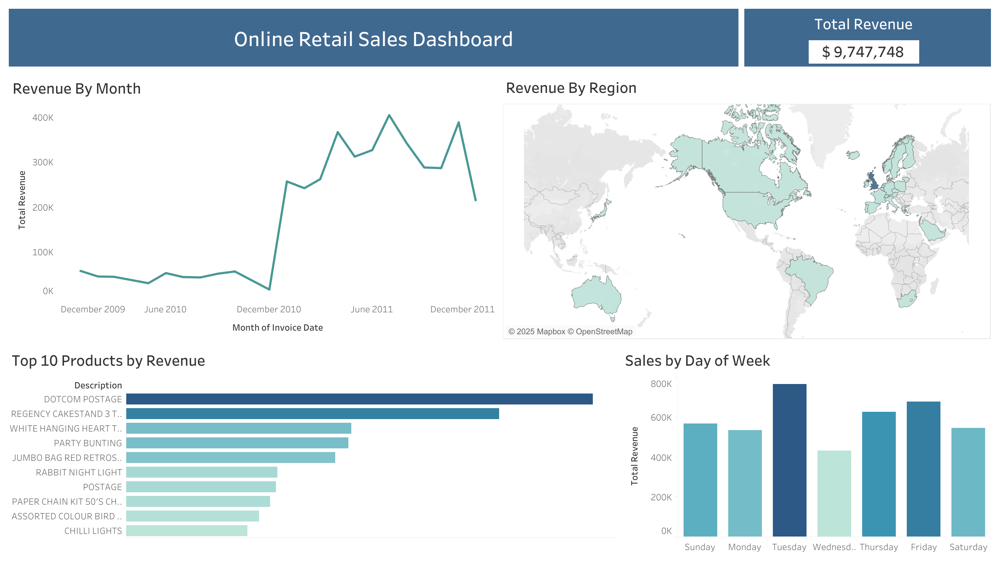

# Online Retail Sales Dashboard (Tableau)

**[Click Here to View the Live Dashboard on Tableau Public](https://public.tableau.com/app/profile/naveen.teja.pedapudi/viz/OnlineRetailSalesDashboard_17632070076060/Dashboard1)**

---

## 1. Project Overview

This project involved analyzing a large transactional dataset (542,000+ rows) from a UK-based online retailer. The goal was to clean, transform, and visualize the data _entirely within Tableau_ to create an executive sales dashboard that answers key business questions.

## 2. Tools Used

- **Visualization & Analysis:** Tableau Public
- **Data Source:** Kaggle ([Online Retail Transaction Data - Single CSV](https://www.kaggle.com/datasets/thedevastator/online-retail-transaction-data))

## 3. The Process

1.  **Data Loading & Cleaning:**
    - Connected Tableau directly to the 542k row CSV file.
    - Filtered out all canceled orders (rows where 'InvoiceNo' started with 'c').
    - Handled null values found in the raw data.
2.  **Feature Engineering (in Tableau):**
    - Created new **Calculated Fields** to enable deeper analysis, including:
      - `TotalRevenue` ([Quantity] \* [UnitPrice])
      - `Day of Week` (Extracted from the [InvoiceDate] field)
      - `Month` (Extracted from the [InvoiceDate] field)
3.  **Dashboard Creation:**
    - Designed and built a 4-chart dashboard to provide a high-level summary of business performance.

## 4. Key Insights from the Dashboard

- **Geographic Focus:** The United Kingdom is the primary market, accounting for the vast majority of all company revenue.
- **Sales Trend:** The "Revenue By Month" chart shows a significant increase in sales during the last quarter (Oct-Nov-Dec), indicating strong holiday seasonality.
- **Peak Sales Day:** Thursdays were identified as the busiest day of the week, suggesting a target for staffing or promotions.
- **Top Products:** The dashboard clearly displays the Top 10 products, allowing managers to focus on key inventory.

## 5. Final Dashboard

