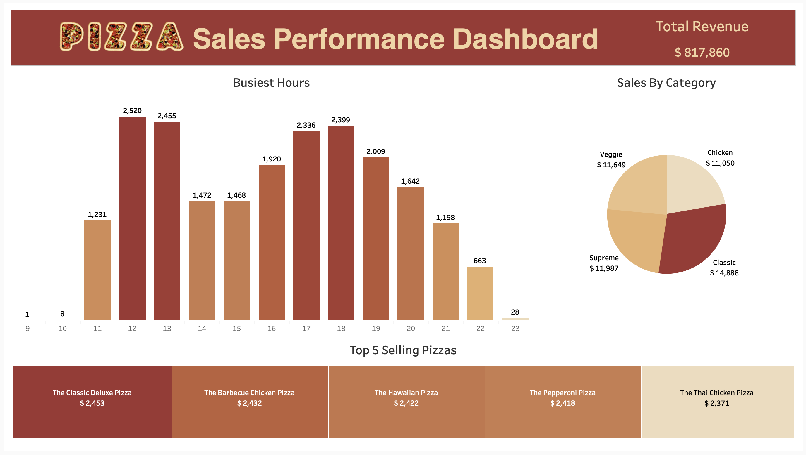

# Pizza Place: Sales & Order Analysis (MySQL & Tableau)

[Live Dashboard on Tableau Public](https://public.tableau.com/app/profile/naveen.teja.pedapudi/viz/PizzaplaceSalesOrderAnalysis/Dashboard1)

## Project Overview

This project analyzes over 48,000 order records from a pizza restaurant to identify sales trends and customer behavior. The goal was to perform all data extraction and analysis using SQL and visualize the final insights in Tableau.

## Tools

- **Database:** MySQL
- **Visualization:** Tableau Public
- **Code:** SQL
- **Data Source:** Kaggle ([Pizza Place Sales](https://www.kaggle.com/datasets/mysarahmadbhat/pizza-place-sales))

## SQL Analysis

All analysis was performed using SQL. Key queries focused on:

- Joining 4 tables to connect order details with pizza names and prices.
- Calculating total revenue using SUM() and aggregate functions.
- Identifying peak order times by grouping by HOUR().
- Ranking top and bottom-selling pizzas using GROUP BY and ORDER BY.

You can view the exact queries used in the [analysis.sql](analysis.sql)

## Key Insights

- Total revenue from all orders was $817,860.
- The busiest time for orders is 12:00 PM, with a smaller peak at 6:00 PM.
- The "Classic Deluxe" is the best-selling pizza, while the "Brie Carre" is the worst-seller.

## Final Dashboard

